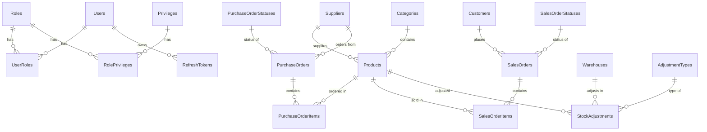

# 📦 Inventory Management System — Final Project Documentation

> A **production-grade** ASP.NET Core Web API with **Dynamic RBAC**, JWT cookie-based auth, refresh tokens, and business logic across **12 modules**.

---

## 📌 Tech Stack

| Layer            | Technology                                 |
| ---------------- | ------------------------------------------ |
| **Framework**    | ASP.NET Core (.NET 10) Web API             |
| **ORM**          | Entity Framework Core (**DB-First**)       |
| **Database**     | SQL Server — `InventoryManagementDB`       |
| **Auth**         | JWT Bearer + HttpOnly Cookie + **Dynamic RBAC** |
| **Refresh Token**| Single token per user (update-or-create)   |
| **Validation**   | Data Annotations                           |
| **Mapping**      | AutoMapper (Entity ↔ DTO)                  |
| **Email**        | MailKit (SMTP) for OTP                     |
| **API Docs**     | Swagger / Swashbuckle                      |
| **Architecture** | Clean Architecture (Repository + Service)  |
| **Caching**      | In-Memory Cache (OTP storage)              |
| **Password**     | BCrypt.Net                                 |
| **Clock**        | Standardized UTC (`DateTime.UtcNow`)       |

---

## 🏗️ Project Architecture

```
InventoryManagementSystem/
│
├── Database/                        # SQL Scripts (DB-First source of truth)
│   ├── script.sql                   # Full DB script with seed data
│   └── InventoryManagementDBTillModule2.sql
│
├── Docs/                            # Project documentation
│
└── InvMS/                           # .NET Solution root
    │
    ├── Domain/                      # Entities, Enums, Exceptions
    │   ├── Entities/                # Scaffolded from DB
    │   ├── Enums/                   # UserType.cs (not currently used)
    │   └── Exceptions/              # NotFoundException, BadRequestException, UnauthorizedException
    │
    ├── Application/                 # Business logic, DTOs, Interfaces
    │   ├── DTOs/
    │   │   ├── Auth/                # 10 DTOs (Login, Register, UserDto, etc.)
    │   │   ├── Category/            # CategoryDto, CreateCategoryDto
    │   │   └── RolesAndPrivileges/  # RoleDto, PrivilegeDto, RolePrivilegeDto, etc.
    │   ├── Interfaces/              # 13 interfaces (IService + IRepository)
    │   ├── Services/                # 6 services (Auth, User, Category, Role, Privilege, RolePrivilege)
    │   ├── Mappings/                # MappingProfile.cs (AutoMapper)
    │   ├── Security/                # DynamicPermissionPolicyProvider, PermissionHandler, PermissionRequirement
    │   ├── Common/                  # APIResponse.cs
    │   └── DependencyInjection.cs   # AddApplication() extension method
    │
    ├── Infrastructure/              # Data access, DbContext, Repositories
    │   ├── Data/
    │   │   ├── InventoryDbContext.cs # DbSets + Fluent API (mirrors DB schema)
    │   │   └── DbSeeder.cs          # Seeds admin user on startup
    │   ├── Repositories/            # 6 repositories
    │   ├── ThirdPartyServices/
    │   │   └── EmailService.cs      # MailKit SMTP for OTP emails
    │   └── DependencyInjection.cs   # AddInfrastructure() extension method
    │
    └── InvMS/ (API Layer)           # Startup project
        ├── Controller/              # 6 controllers
        ├── Middleware/              # ExceptionMiddleware.cs
        ├── Program.cs              # DI, JWT config, cookie auth, middleware
        └── appsettings.json
```

---

## 🔄 DB-First Workflow

This project follows a **DB-First** approach. The workflow for each module is:

```
1. Write SQL → CREATE TABLE in SQL Server (InventoryManagementDB)
2. Scaffold → dotnet ef dbcontext scaffold (or manually create Entity class matching the table)
3. Configure → Add DbSet + Fluent API config in InventoryDbContext.cs
4. Build → Create DTOs, Interface, Repository, Service, Controller
5. Register → Add to DependencyInjection.cs (both Application & Infrastructure)
```

> **Important:** All "enum-like" values (order statuses, adjustment types, etc.) should be implemented as **lookup tables** in the database, not C# enums. This is consistent with the DB-First approach.

---

## 🗄️ Database Schema

### ✅ Current Tables (Implemented)

```sql
-- Database: InventoryManagementDB

-- 1. Users
CREATE TABLE Users (
    Id INT IDENTITY(1,1) PRIMARY KEY,
    Username NVARCHAR(50) NOT NULL UNIQUE,
    PasswordHash NVARCHAR(MAX) NOT NULL,
    FullName NVARCHAR(100) NOT NULL,
    Email NVARCHAR(100) NOT NULL UNIQUE,
    IsDeleted BIT NOT NULL DEFAULT 0,
    CreatedDate DATETIME2 NOT NULL DEFAULT SYSDATETIME(),
    ModifiedDate DATETIME2 NULL
);

-- 2. Roles
CREATE TABLE Roles (
    Id INT IDENTITY(1,1) PRIMARY KEY,
    Name NVARCHAR(50) NOT NULL UNIQUE,
    Description NVARCHAR(200) NULL,
    CreatedDate DATETIME2 NOT NULL DEFAULT GETUTCDATE()
);

-- 3. Privileges
CREATE TABLE Privileges (
    Id INT IDENTITY(1,1) PRIMARY KEY,
    Name NVARCHAR(100) NOT NULL UNIQUE,
    Description NVARCHAR(200) NULL
);

-- 4. UserRoles (Many-to-Many: Users ↔ Roles)
CREATE TABLE UserRoles (
    UserId INT NOT NULL REFERENCES Users(Id) ON DELETE CASCADE,
    RoleId INT NOT NULL REFERENCES Roles(Id) ON DELETE CASCADE,
    PRIMARY KEY (UserId, RoleId)
);

-- 5. RolePrivileges (Many-to-Many: Roles ↔ Privileges)
CREATE TABLE RolePrivileges (
    RoleId INT NOT NULL REFERENCES Roles(Id) ON DELETE CASCADE,
    PrivilegeId INT NOT NULL REFERENCES Privileges(Id) ON DELETE CASCADE,
    PRIMARY KEY (RoleId, PrivilegeId)
);

-- 6. Categories
CREATE TABLE Categories (
    Id INT IDENTITY(1,1) PRIMARY KEY,
    Name NVARCHAR(100) NOT NULL UNIQUE,
    Description NVARCHAR(500) NULL,
    IsDeleted BIT NOT NULL DEFAULT 0,
    CreatedDate DATETIME2 NOT NULL DEFAULT SYSDATETIME(),
    ModifiedDate DATETIME2 NULL
);

-- 7. RefreshTokens
CREATE TABLE RefreshTokens (
    Id INT IDENTITY(1,1) PRIMARY KEY,
    UserId INT NOT NULL REFERENCES Users(Id),
    Token NVARCHAR(500) NOT NULL,
    ExpiresAt DATETIME2 NOT NULL,
    IsRevoked BIT NULL DEFAULT 0,
    CreatedAt DATETIME2 NULL DEFAULT GETUTCDATE()
);
```

### Seed Data (Current)

| Table | Seeded Data |
|-------|-------------|
| **Roles** | Admin (Id=4), Manager (Id=5), Staff (Id=6) |
| **Users** | admin, aryan (Manager), kartik (Staff), nikhil (Staff), darshit (Staff) |
| **Privileges** | ViewCategories (9), CreateCategory (10), UpdateCategory (11), DeleteCategory (12), ManageUsers (13) |
| **RolePrivileges** | Admin → all 5 privileges; Manager → View+Create+Update Categories; Staff → View Categories |

---

### 📋 Planned Tables (Modules 5–12)

> For each new table: Write SQL first → then scaffold/create Entity → then build the layers.

#### Module 5 & 6: Suppliers & Customers

```sql
CREATE TABLE Suppliers (
    Id INT IDENTITY(1,1) PRIMARY KEY,
    Name NVARCHAR(100) NOT NULL,
    ContactPerson NVARCHAR(100) NULL,
    Email NVARCHAR(100) NULL,
    Phone NVARCHAR(20) NULL,
    Address NVARCHAR(500) NULL,
    City NVARCHAR(100) NULL,
    IsDeleted BIT NOT NULL DEFAULT 0,
    CreatedDate DATETIME2 NOT NULL DEFAULT GETUTCDATE(),
    ModifiedDate DATETIME2 NULL
);

CREATE TABLE Customers (
    Id INT IDENTITY(1,1) PRIMARY KEY,
    Name NVARCHAR(100) NOT NULL,
    Email NVARCHAR(100) NULL,
    Phone NVARCHAR(20) NULL,
    Address NVARCHAR(500) NULL,
    City NVARCHAR(100) NULL,
    IsDeleted BIT NOT NULL DEFAULT 0,
    CreatedDate DATETIME2 NOT NULL DEFAULT GETUTCDATE(),
    ModifiedDate DATETIME2 NULL
);
```

#### Module 7: Warehouses

```sql
CREATE TABLE Warehouses (
    Id INT IDENTITY(1,1) PRIMARY KEY,
    Name NVARCHAR(100) NOT NULL,
    Location NVARCHAR(200) NULL,
    Description NVARCHAR(500) NULL,
    IsDeleted BIT NOT NULL DEFAULT 0,
    CreatedDate DATETIME2 NOT NULL DEFAULT GETUTCDATE(),
    ModifiedDate DATETIME2 NULL
);
```

#### Module 8: Products

```sql
CREATE TABLE Products (
    Id INT IDENTITY(1,1) PRIMARY KEY,
    Name NVARCHAR(200) NOT NULL,
    SKU NVARCHAR(50) NOT NULL UNIQUE,
    Description NVARCHAR(500) NULL,
    UnitPrice DECIMAL(18,2) NOT NULL,
    CostPrice DECIMAL(18,2) NOT NULL,
    CurrentStock INT NOT NULL DEFAULT 0,
    ReorderLevel INT NOT NULL DEFAULT 0,
    CategoryId INT NOT NULL REFERENCES Categories(Id),
    SupplierId INT NOT NULL REFERENCES Suppliers(Id),
    RowVersion ROWVERSION,            -- Optimistic concurrency
    IsDeleted BIT NOT NULL DEFAULT 0,
    CreatedDate DATETIME2 NOT NULL DEFAULT GETUTCDATE(),
    ModifiedDate DATETIME2 NULL
);
```

#### Module 9: Purchase Orders — Status as Lookup Table

```sql
-- Lookup table for PO statuses (NOT a C# enum)
CREATE TABLE PurchaseOrderStatuses (
    Id INT IDENTITY(1,1) PRIMARY KEY,
    Name NVARCHAR(50) NOT NULL UNIQUE   -- Draft, Approved, Received, Cancelled
);
INSERT INTO PurchaseOrderStatuses (Name) VALUES ('Draft'), ('Approved'), ('Received'), ('Cancelled');

CREATE TABLE PurchaseOrders (
    Id INT IDENTITY(1,1) PRIMARY KEY,
    OrderNumber NVARCHAR(50) NOT NULL UNIQUE,  -- Auto: "PO-{yyyyMMdd}-{seq}"
    SupplierId INT NOT NULL REFERENCES Suppliers(Id),
    OrderDate DATETIME2 NOT NULL DEFAULT GETUTCDATE(),
    ExpectedDeliveryDate DATETIME2 NULL,
    StatusId INT NOT NULL REFERENCES PurchaseOrderStatuses(Id),  -- FK to lookup table
    TotalAmount DECIMAL(18,2) NOT NULL DEFAULT 0,
    Notes NVARCHAR(1000) NULL,
    CreatedDate DATETIME2 NOT NULL DEFAULT GETUTCDATE(),
    ModifiedDate DATETIME2 NULL
);

CREATE TABLE PurchaseOrderItems (
    Id INT IDENTITY(1,1) PRIMARY KEY,
    PurchaseOrderId INT NOT NULL REFERENCES PurchaseOrders(Id) ON DELETE CASCADE,
    ProductId INT NOT NULL REFERENCES Products(Id),
    Quantity INT NOT NULL,
    UnitCost DECIMAL(18,2) NOT NULL,
    LineTotal AS (Quantity * UnitCost) PERSISTED   -- Computed column
);
```

#### Module 10: Sales Orders — Status as Lookup Table

```sql
-- Lookup table for SO statuses (NOT a C# enum)
CREATE TABLE SalesOrderStatuses (
    Id INT IDENTITY(1,1) PRIMARY KEY,
    Name NVARCHAR(50) NOT NULL UNIQUE   -- Pending, Confirmed, Shipped, Delivered, Cancelled
);
INSERT INTO SalesOrderStatuses (Name) VALUES ('Pending'), ('Confirmed'), ('Shipped'), ('Delivered'), ('Cancelled');

CREATE TABLE SalesOrders (
    Id INT IDENTITY(1,1) PRIMARY KEY,
    OrderNumber NVARCHAR(50) NOT NULL UNIQUE,  -- Auto: "SO-{yyyyMMdd}-{seq}"
    CustomerId INT NOT NULL REFERENCES Customers(Id),
    OrderDate DATETIME2 NOT NULL DEFAULT GETUTCDATE(),
    StatusId INT NOT NULL REFERENCES SalesOrderStatuses(Id),  -- FK to lookup table
    TotalAmount DECIMAL(18,2) NOT NULL DEFAULT 0,
    Notes NVARCHAR(1000) NULL,
    CreatedDate DATETIME2 NOT NULL DEFAULT GETUTCDATE(),
    ModifiedDate DATETIME2 NULL
);

CREATE TABLE SalesOrderItems (
    Id INT IDENTITY(1,1) PRIMARY KEY,
    SalesOrderId INT NOT NULL REFERENCES SalesOrders(Id) ON DELETE CASCADE,
    ProductId INT NOT NULL REFERENCES Products(Id),
    Quantity INT NOT NULL,
    UnitPrice DECIMAL(18,2) NOT NULL,
    LineTotal AS (Quantity * UnitPrice) PERSISTED   -- Computed column
);
```

#### Module 11: Stock Adjustments — Type as Lookup Table

```sql
-- Lookup table for adjustment types (NOT a C# enum)
CREATE TABLE AdjustmentTypes (
    Id INT IDENTITY(1,1) PRIMARY KEY,
    Name NVARCHAR(50) NOT NULL UNIQUE   -- Damage, Theft, Correction, Return, Other
);
INSERT INTO AdjustmentTypes (Name) VALUES ('Damage'), ('Theft'), ('Correction'), ('Return'), ('Other');

CREATE TABLE StockAdjustments (
    Id INT IDENTITY(1,1) PRIMARY KEY,
    ProductId INT NOT NULL REFERENCES Products(Id),
    WarehouseId INT NOT NULL REFERENCES Warehouses(Id),
    QuantityChange INT NOT NULL,         -- +5 or -3
    AdjustmentTypeId INT NOT NULL REFERENCES AdjustmentTypes(Id),  -- FK to lookup table
    Reason NVARCHAR(500) NULL,
    AdjustedBy INT NOT NULL REFERENCES Users(Id),   -- From JWT claims
    AdjustmentDate DATETIME2 NOT NULL DEFAULT GETUTCDATE()
);
```

### ER Diagram



---

## 🔐 Security: Dynamic RBAC (✅ Implemented)

Instead of hardcoded roles, the system uses **Dynamic Permission-Based Authorization**:

1. **Privileges** table stores permission strings (e.g., `ManageUsers`, `ViewCategories`).
2. **Roles** are collections of Privileges (many-to-many via `RolePrivileges`).
3. **Users** are assigned Roles (many-to-many via `UserRoles`).
4. During **Login**, all permissions are embedded into JWT claims as `"Permission"` claims.
5. On any controller: `[Authorize(Policy = "PermissionName")]` — the `DynamicPermissionPolicyProvider` evaluates it automatically.

**Key Files:**
- `Application/Security/DynamicPermissionPolicyProvider.cs`
- `Application/Security/PermissionHandler.cs`
- `Application/Security/PermissionRequirement.cs`

### JWT + Cookie Auth (✅ Implemented)

- **Access Token**: Set in `accesstoken` HttpOnly cookie (1-minute expiry for testing).
- **Refresh Token**: Set in `refreshtoken` HttpOnly cookie (7-day expiry).
- **Cookie-to-Bearer**: `JwtBearerEvents.OnMessageReceived` in `Program.cs` reads from `accesstoken` cookie automatically.
- **Single Token per User**: Login checks for existing refresh token and updates it instead of creating a new row.

### Password Reset (✅ Implemented)

- **Forgot Password** → Sends OTP via MailKit SMTP.
- **OTP Storage** → In-memory cache with 2-minute expiry.
- **Reset Password** → Validates OTP, hashes new password with BCrypt.

---

## 📡 API Modules & Endpoints

### ✅ Module 1: Authentication (6 Endpoints)

| Method | Endpoint | Description | Auth | Permission |
|--------|----------|-------------|------|------------|
| `POST` | `/api/auth/register` | Register new user | Auth | `ManageUserRegistration` |
| `POST` | `/api/auth/login` | Login (sets JWT + Refresh in cookies) | Public | — |
| `POST` | `/api/auth/refresh` | Refresh access token | Public | — |
| `POST` | `/api/auth/change-password` | Change own password | Auth | — |
| `POST` | `/api/auth/forgot-password` | Send OTP to email | Public | — |
| `POST` | `/api/auth/reset-password` | Reset password with OTP | Public | — |

### ✅ Module 2: User Management (5 Endpoints)

| Method | Endpoint | Description | Auth | Permission |
|--------|----------|-------------|------|------------|
| `GET` | `/api/users/GetAllUsers` | List all active users | Auth | `ManageUsers` |
| `GET` | `/api/users/{id}` | Get user by ID | Auth | `ManageUsers` |
| `GET` | `/api/users/me` | Get own profile | Auth | — |
| `PUT` | `/api/users/{id}` | Update user info | Auth | `ManageUsers` |
| `DELETE` | `/api/users/{id}` | Soft delete user | Auth | `ManageUsers` |

### ✅ Module 3: Category Management (5 Endpoints)

| Method | Endpoint | Description | Auth | Permission |
|--------|----------|-------------|------|------------|
| `GET` | `/api/categories/GetAllCategories` | List all categories | Auth | `ViewCategories` |
| `GET` | `/api/categories/{id}` | Get category by ID | Auth | `ViewCategories` |
| `POST` | `/api/categories/CreateCategory` | Create category | Auth | `CreateCategory` |
| `PUT` | `/api/categories/{id}` | Update category | Auth | `UpdateCategory` |
| `DELETE` | `/api/categories/{id}` | Soft delete | Auth | `DeleteCategory` |

### ✅ Module 4: Role & Privilege Management (6 Endpoints)

| Method | Endpoint | Description | Auth | Permission |
|--------|----------|-------------|------|------------|
| `GET` | `/api/roles/all` | List all roles | Auth | `ManageRoles` |
| `POST` | `/api/roles/create` | Create role | Auth | `ManageRoles` |
| `PUT` | `/api/roles/update/{id}` | Update role | Auth | `ManageRoles` |
| `DELETE` | `/api/roles/delete/{id}` | Soft delete role | Auth | `ManageRoles` |
| `GET` | `/api/privileges/all` | List all permissions | Auth | `ManagePrivileges` |
| `POST` | `/api/roleprivileges/assign` | Map permission to role | Auth | `ManageRoleAndPrivilegeMapping` |

---

## 📋 Pending Modules — Build in This Order

> For each module: **SQL first → Entity → DbSet → DTOs → Interface → Repository → Service → DI → Controller → Seed Privileges**

---

### 📋 Module 5: Supplier Management (7 Endpoints)

| Method | Endpoint | Description | Permission |
|--------|----------|-------------|------------|
| `GET` | `/api/suppliers` | Get all (paginated, search) | `ViewSuppliers` |
| `GET` | `/api/suppliers/{id}` | Get by ID | `ViewSuppliers` |
| `POST` | `/api/suppliers` | Create | `ManageSuppliers` |
| `PUT` | `/api/suppliers/{id}` | Update | `ManageSuppliers` |
| `DELETE` | `/api/suppliers/{id}` | Soft delete | `DeleteSuppliers` |
| `GET` | `/api/suppliers/{id}/products` | Products from supplier | `ViewSuppliers` |
| `GET` | `/api/suppliers/{id}/purchase-orders` | PO history | `ViewSuppliers` |

**DTOs:** `SupplierDto`, `CreateSupplierDto`, `UpdateSupplierDto`
**Privileges to seed:** `ViewSuppliers`, `ManageSuppliers`, `DeleteSuppliers`

---

### 📋 Module 6: Customer Management (7 Endpoints)

| Method | Endpoint | Description | Permission |
|--------|----------|-------------|------------|
| `GET` | `/api/customers` | Get all (paginated, search) | `ViewCustomers` |
| `GET` | `/api/customers/{id}` | Get by ID | `ViewCustomers` |
| `POST` | `/api/customers` | Create | `ManageCustomers` |
| `PUT` | `/api/customers/{id}` | Update | `ManageCustomers` |
| `DELETE` | `/api/customers/{id}` | Soft delete | `DeleteCustomers` |
| `GET` | `/api/customers/{id}/sales-orders` | Order history | `ViewCustomers` |
| `GET` | `/api/customers/search?name=&city=` | Search | `ViewCustomers` |

**DTOs:** `CustomerDto`, `CreateCustomerDto`, `UpdateCustomerDto`

---

### 📋 Module 7: Warehouse Management (5 Endpoints)

| Method | Endpoint | Description | Permission |
|--------|----------|-------------|------------|
| `GET` | `/api/warehouses` | Get all | `ViewWarehouses` |
| `GET` | `/api/warehouses/{id}` | Get by ID | `ViewWarehouses` |
| `POST` | `/api/warehouses` | Create | `ManageWarehouses` |
| `PUT` | `/api/warehouses/{id}` | Update | `ManageWarehouses` |
| `DELETE` | `/api/warehouses/{id}` | Soft delete | `DeleteWarehouses` |

**DTOs:** `WarehouseDto`, `CreateWarehouseDto`, `UpdateWarehouseDto`

---

### 📋 Module 8: Product Management — Core Module (10 Endpoints)

| Method | Endpoint | Description | Permission |
|--------|----------|-------------|------------|
| `GET` | `/api/products` | Get all (paginated, filterable, sortable) | `ViewProducts` |
| `GET` | `/api/products/{id}` | Get by ID (includes category & supplier) | `ViewProducts` |
| `GET` | `/api/products/sku/{sku}` | Get by SKU code | `ViewProducts` |
| `POST` | `/api/products` | Create (unique SKU check) | `ManageProducts` |
| `PUT` | `/api/products/{id}` | Update (with concurrency check) | `ManageProducts` |
| `PATCH` | `/api/products/{id}` | Partial update (JSON Patch) | `ManageProducts` |
| `DELETE` | `/api/products/{id}` | Soft delete | `DeleteProducts` |
| `GET` | `/api/products/low-stock` | CurrentStock ≤ ReorderLevel | `ViewProducts` |
| `GET` | `/api/products/out-of-stock` | CurrentStock = 0 | `ViewProducts` |
| `GET` | `/api/products/search?name=&categoryId=&supplierId=` | Search | `ViewProducts` |

**Key Features:**
- Pagination: `?pageNumber=1&pageSize=10` → Create `PaginatedResult<T>` in `Application/Common/`
- Concurrency: `RowVersion` (ROWVERSION in SQL) → Handle `DbUpdateConcurrencyException` → return `409 Conflict`

---

### 📋 Module 9: Purchase Orders (7 Endpoints)

| Method | Endpoint | Description | Permission |
|--------|----------|-------------|------------|
| `GET` | `/api/purchase-orders` | Get all (filter by status) | `ViewPurchaseOrders` |
| `GET` | `/api/purchase-orders/{id}` | Get with line items | `ViewPurchaseOrders` |
| `POST` | `/api/purchase-orders` | Create (status = Draft) | `ManagePurchaseOrders` |
| `PUT` | `/api/purchase-orders/{id}` | Update (only if Draft) | `ManagePurchaseOrders` |
| `DELETE` | `/api/purchase-orders/{id}` | Cancel (Draft/Approved only) | `DeletePurchaseOrders` |
| `PATCH` | `/api/purchase-orders/{id}/approve` | Draft → Approved | `ManagePurchaseOrders` |
| `PATCH` | `/api/purchase-orders/{id}/receive` | Approved → Received **(stock ↑)** | `ManagePurchaseOrders` |

**Status Workflow:** `Draft → Approved → Received` / `Cancelled`

**Business Logic:**
- Must have ≥ 1 line item
- `TotalAmount` = SUM of all `LineTotal` (auto-calculated)
- `OrderNumber` auto-generated: `PO-{yyyyMMdd}-{seq}`
- On **Receive** → increase `Product.CurrentStock` inside **DB Transaction**
- If any stock update fails → entire transaction rolls back

---

### 📋 Module 10: Sales Orders (9 Endpoints)

| Method | Endpoint | Description | Permission |
|--------|----------|-------------|------------|
| `GET` | `/api/sales-orders` | Get all (filter by status) | `ViewSalesOrders` |
| `GET` | `/api/sales-orders/{id}` | Get with line items | `ViewSalesOrders` |
| `POST` | `/api/sales-orders` | Create **(validates stock)** | `ManageSalesOrders` |
| `PUT` | `/api/sales-orders/{id}` | Update (only if Pending) | `ManageSalesOrders` |
| `DELETE` | `/api/sales-orders/{id}` | Cancel (restores stock if Confirmed) | `DeleteSalesOrders` |
| `PATCH` | `/api/sales-orders/{id}/confirm` | Pending → Confirmed **(stock ↓)** | `ManageSalesOrders` |
| `PATCH` | `/api/sales-orders/{id}/ship` | Confirmed → Shipped | `ManageSalesOrders` |
| `PATCH` | `/api/sales-orders/{id}/deliver` | Shipped → Delivered | `ManageSalesOrders` |
| `GET` | `/api/sales-orders/search?status=&customerId=&startDate=&endDate=` | Search | `ViewSalesOrders` |

**Status Workflow:** `Pending → Confirmed → Shipped → Delivered` / `Cancelled`

**Business Logic:**
- On **Create** → validate `CurrentStock >= Quantity` (return `400` if insufficient)
- On **Confirm** → deduct stock inside **DB Transaction**
- On **Cancel** (from Confirmed) → restore stock inside **DB Transaction**

---

### 📋 Module 11: Stock Adjustments (4 Endpoints)

| Method | Endpoint | Description | Permission |
|--------|----------|-------------|------------|
| `GET` | `/api/stock-adjustments` | Get all (paginated) | `ViewStockAdjustments` |
| `GET` | `/api/stock-adjustments/{id}` | Get by ID | `ViewStockAdjustments` |
| `POST` | `/api/stock-adjustments` | Create **(updates stock)** | `ManageStockAdjustments` |
| `GET` | `/api/stock-adjustments/product/{productId}` | History for product | `ViewStockAdjustments` |

**Business Logic:**
- `CurrentStock + QuantityChange` must be ≥ 0
- `AdjustedBy` auto-set from JWT claims

---

### 📋 Module 12: Dashboard & Reports (7 Endpoints)

| Method | Endpoint | Description | Permission |
|--------|----------|-------------|------------|
| `GET` | `/api/dashboard/summary` | Overall summary | `ViewDashboard` |
| `GET` | `/api/dashboard/low-stock-alerts` | Below reorder level | `ViewDashboard` |
| `GET` | `/api/reports/sales-by-product?startDate=&endDate=` | Sales by product | `ViewReports` |
| `GET` | `/api/reports/purchases-by-supplier?startDate=&endDate=` | Purchases by supplier | `ViewReports` |
| `GET` | `/api/reports/stock-movement?year=` | Stock in vs out/month | `ViewReports` |
| `GET` | `/api/reports/revenue?startDate=&endDate=` | Revenue summary | `ViewReports` |
| `GET` | `/api/reports/order-status-summary` | Orders by status | `ViewReports` |

**Dashboard Summary Returns:** Total Products, Categories, Suppliers, Customers, Low Stock Count, Out of Stock Count, Pending POs/SOs, Total Stock Value = `SUM(CostPrice × CurrentStock)`

---

## 📊 Endpoint Summary

| Module                     | Endpoints | Status         |
|----------------------------|-----------|----------------|
| Authentication             | 6         | ✅ Implemented  |
| User Management            | 5         | ✅ Implemented  |
| Category Management        | 5         | ✅ Implemented  |
| Role & Privilege Mgmt      | 6         | ✅ Implemented  |
| Supplier Management        | 7         | 📋 Pending     |
| Customer Management        | 7         | 📋 Pending     |
| Warehouse Management       | 5         | 📋 Pending     |
| Product Management         | 10        | 📋 Pending     |
| Purchase Orders            | 7         | 📋 Pending     |
| Sales Orders               | 9         | 📋 Pending     |
| Stock Adjustments          | 4         | 📋 Pending     |
| Dashboard & Reports        | 7         | 📋 Pending     |
| **Total**                  | **78**    |                |

---

## 📦 Build Order

| Phase | Module | Depends On | Status |
|-------|--------|------------|--------|
| 1 | Project Setup + Architecture | — | ✅ Done |
| 2 | Auth & Users | — | ✅ Done |
| 3 | Categories | — | ✅ Done |
| 4 | Roles & Privileges (Dynamic RBAC) | — | ✅ Done |
| 5 | **Suppliers** | — | 📋 Next |
| 6 | **Customers** | — | 📋 Pending |
| 7 | **Warehouses** | — | 📋 Pending |
| 8 | **Products** | Categories, Suppliers | 📋 Pending |
| 9 | **Purchase Orders** | Suppliers, Products | 📋 Pending |
| 10 | **Sales Orders** | Customers, Products | 📋 Pending |
| 11 | **Stock Adjustments** | Products, Warehouses | 📋 Pending |
| 12 | **Dashboard & Reports** | All modules | 📋 Pending |

---

## 🧩 Per-Module Implementation Pattern (DB-First)

```
 1. SQL Server        → CREATE TABLE + constraints + seed data
 2. Domain/Entities/  → Create Entity class (matching DB columns exactly)
 3. InventoryDbContext → Add DbSet<Entity> + Fluent API config (OnModelCreating)
 4. Application/DTOs/ → Create DTOs (ReadDto, CreateDto, UpdateDto)
 5. MappingProfile.cs → Add AutoMapper maps (Entity ↔ DTO)
 6. Application/Interfaces/ → Create IXxxRepository + IXxxService
 7. Application/Services/   → Implement XxxService
 8. Infrastructure/Repos/   → Implement XxxRepository
 9. Application/DependencyInjection.cs → Register IXxxService → XxxService
10. Infrastructure/DependencyInjection.cs → Register IXxxRepository → XxxRepository
11. InvMS/Controller/ → Create XxxController with [Authorize(Policy=...)]
12. SQL Server        → INSERT privileges for the new module
```

---

## 🔧 Already Implemented Features

| # | Feature | Details |
|---|---------|---------|
| 1 | **APIResponse Wrapper** | `{ Status, StatusCode, Data, Error }` |
| 2 | **Standardized UTC** | All timestamps use `DateTime.UtcNow` |
| 3 | **Soft Delete** | `IsDeleted` flag across the board |
| 4 | **Global Exception Handling** | `ExceptionMiddleware` |
| 5 | **Clean Architecture** | Domain → Application → Infrastructure → API |
| 6 | **Dynamic RBAC** | `DynamicPermissionPolicyProvider` + `PermissionHandler` |
| 7 | **JWT Cookie Auth** | `OnMessageReceived` reads from cookie |
| 8 | **Single Refresh Token** | One per user, updated on login/refresh |
| 9 | **OTP Email Reset** | MailKit SMTP + in-memory cache |
| 10 | **Admin Seed** | `DbSeeder.SeedAdminAsync` on startup |
| 11 | **AutoMapper Profiles** | Entity ↔ DTO |
| 12 | **BCrypt Password Hashing** | Secure storage |

## 🔧 Features to Implement in Pending Modules

| # | Feature | Where |
|---|---------|-------|
| 1 | **Pagination & Sorting** | Products, Suppliers, Customers, Orders |
| 2 | **`PaginatedResult<T>`** | `Application/Common/` (reusable) |
| 3 | **Optimistic Concurrency** | Products (`ROWVERSION` in SQL) |
| 4 | **DB Transactions** | PO Receive (stock ↑), SO Confirm (stock ↓) |
| 5 | **Status Workflows** | Via lookup tables (PO/SO statuses) |
| 6 | **Auto Order Numbers** | `PO-{yyyyMMdd}-{seq}`, `SO-{yyyyMMdd}-{seq}` |
| 7 | **Stock Validation** | Check availability before SO creation |
| 8 | **Dashboard Aggregation** | Stock value, alerts, revenue |

---

## 🚀 Resume Description

```
Inventory Management System — ASP.NET Core Web API
─────────────────────────────────────────────────────
• Built a production-grade Inventory Management System backend
  with 78 RESTful API endpoints across 12 modules using Clean Architecture
• Implemented JWT authentication with HttpOnly cookie delivery,
  refresh tokens, and Dynamic RBAC (Permission-based authorization)
• Built full CRUD for Products, Suppliers, Customers, Categories,
  and Warehouses with pagination, sorting, and soft-delete
• Implemented Purchase Order (Draft → Approved → Received) and
  Sales Order (Pending → Confirmed → Shipped → Delivered) workflows
  with atomic stock updates using EF Core database transactions
• Used optimistic concurrency control (RowVersion) on Product entity
• Followed DB-First approach with Entity Framework Core and SQL Server
• Added email-based OTP password reset, global exception handling,
  and admin seed data

Tech: C#, ASP.NET Core, EF Core (DB-First), SQL Server, JWT, BCrypt,
      MailKit, Swagger, AutoMapper, Clean Architecture, Dynamic RBAC
```

---

> **🎯 Next Step:** Start with **Module 5 (Suppliers)** — write the SQL first, then follow the per-module pattern. Commit after each module! 💪
