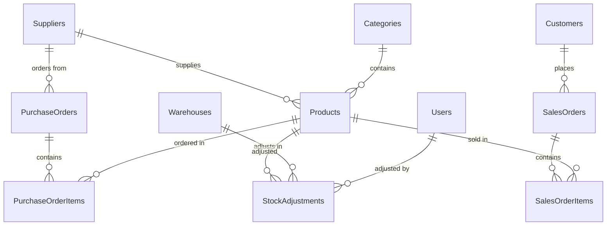

# 📦 Inventory Management System (Warehouse API) — Project Documentation

> A **real-world, resume-worthy** ASP.NET Core Web API project with JWT auth, full CRUD, order processing, stock management, and business logic across 10+ modules.

---

## 📌 Tech Stack

| Layer            | Technology                                 |
| ---------------- | ------------------------------------------ |
| **Framework**    | ASP.NET Core 8 Web API                     |
| **ORM**          | Entity Framework Core (Code-First)         |
| **Database**     | SQL Server                                 |
| **Auth**         | JWT Bearer Tokens + Role-Based Authorization |
| **Validation**   | FluentValidation / Data Annotations        |
| **Mapping**      | AutoMapper (Entity ↔ DTO)                  |
| **Logging**      | Serilog                                    |
| **API Docs**     | Swagger / Swashbuckle                      |
| **Architecture** | Clean Architecture (Repository + Service)  |
| **Concurrency**  | EF Core Optimistic Concurrency (`[Timestamp]`) |

---

## 🏗️ Project Architecture

```
WarehouseApi.sln
│
├── WarehouseApi.Domain/              # Entities, Enums, Exceptions
│   ├── Entities/
│   ├── Enums/
│   └── Exceptions/
│
├── WarehouseApi.Application/         # Business logic, DTOs, Interfaces
│   ├── DTOs/
│   ├── Interfaces/
│   ├── Services/
│   ├── Mappings/
│   ├── Common/                       # APIResponse, PaginatedResult
│   └── DependencyInjection.cs
│
├── WarehouseApi.Infrastructure/      # Data access, DbContext, Repositories
│   ├── Data/
│   │   ├── WarehouseDbContext.cs
│   │   └── Configurations/           # EF Fluent API configs
│   ├── Repositories/
│   └── DependencyInjection.cs
│
└── WarehouseApi/                     # API Layer (startup project)
    ├── Controllers/
    ├── Middleware/                    # Exception handling
    ├── Program.cs
    └── appsettings.json
```

---

## 🗄️ Database Schema

### ER Diagram



### Tables Summary

| #  | Table                  | Key Columns                                                                                                               |
|----|------------------------|---------------------------------------------------------------------------------------------------------------------------|
| 1  | **Users**              | Id, Username, PasswordHash, PasswordSalt, FullName, Email, UserType (enum), IsDeleted, CreatedDate, ModifiedDate          |
| 2  | **Categories**         | Id, Name, Description, IsDeleted, CreatedDate, ModifiedDate                                                                |
| 3  | **Suppliers**          | Id, Name, ContactPerson, Email, Phone, Address, City, IsDeleted, CreatedDate, ModifiedDate                                 |
| 4  | **Customers**          | Id, Name, Email, Phone, Address, City, IsDeleted, CreatedDate, ModifiedDate                                                |
| 5  | **Warehouses**         | Id, Name, Location, Description, IsDeleted, CreatedDate, ModifiedDate                                                      |
| 6  | **Products**           | Id, Name, SKU (unique), Description, UnitPrice, CostPrice, CurrentStock, ReorderLevel, CategoryId (FK), SupplierId (FK), RowVersion (concurrency), IsDeleted, CreatedDate, ModifiedDate |
| 7  | **PurchaseOrders**     | Id, OrderNumber (auto), SupplierId (FK), OrderDate, ExpectedDeliveryDate, Status (enum), TotalAmount, Notes, CreatedDate, ModifiedDate |
| 8  | **PurchaseOrderItems** | Id, PurchaseOrderId (FK), ProductId (FK), Quantity, UnitCost, LineTotal                                                    |
| 9  | **SalesOrders**        | Id, OrderNumber (auto), CustomerId (FK), OrderDate, Status (enum), TotalAmount, Notes, CreatedDate, ModifiedDate           |
| 10 | **SalesOrderItems**    | Id, SalesOrderId (FK), ProductId (FK), Quantity, UnitPrice, LineTotal                                                      |
| 11 | **StockAdjustments**   | Id, ProductId (FK), WarehouseId (FK), QuantityChange (+/-), AdjustmentType (enum), Reason, AdjustedBy, AdjustmentDate     |

> **💡 Tip:** Add `CreatedDate`, `ModifiedDate` audit fields to every master table. Use `[Timestamp]` on `Product.RowVersion` for optimistic concurrency.

---

## 📋 Enums

| Enum                   | Values                                                   |
|------------------------|----------------------------------------------------------|
| **UserType**           | Admin, Manager, Staff                                    |
| **PurchaseOrderStatus**| Draft, Approved, Received, Cancelled                     |
| **SalesOrderStatus**   | Pending, Confirmed, Shipped, Delivered, Cancelled        |
| **AdjustmentType**     | Damage, Theft, Correction, Return, Other                 |

---

## 🔐 Roles & Access Control

| Role        | Access Level                                                   |
|-------------|----------------------------------------------------------------|
| **Admin**   | Full system access — manage everything                         |
| **Manager** | Manage products, orders, stock, reports — cannot manage users  |
| **Staff**   | View products, create orders — limited write access            |

---

## 📡 API Endpoints (70 Total)

---

### Module 1: Authentication & User Management (8 Endpoints)

| #  | Method   | Endpoint                     | Description                  | Auth          |
|----|----------|------------------------------|------------------------------|---------------|
| 1  | `POST`   | `/api/auth/register`         | Register a new user          | Admin         |
| 2  | `POST`   | `/api/auth/login`            | Login and get JWT token      | Public        |
| 3  | `POST`   | `/api/auth/change-password`  | Change own password          | Authenticated |
| 4  | `GET`    | `/api/users`                 | Get all users                | Admin         |
| 5  | `GET`    | `/api/users/{id}`            | Get user by ID               | Admin         |
| 6  | `PUT`    | `/api/users/{id}`            | Update user                  | Admin         |
| 7  | `DELETE` | `/api/users/{id}`            | Soft delete user             | Admin         |
| 8  | `GET`    | `/api/users/me`              | Get own profile              | Authenticated |

---

### Module 2: Category Management (6 Endpoints)

| #  | Method   | Endpoint                        | Description                        | Auth          |
|----|----------|---------------------------------|------------------------------------|---------------|
| 9  | `GET`    | `/api/categories`               | Get all categories (paginated)     | Authenticated |
| 10 | `GET`    | `/api/categories/{id}`          | Get category by ID                 | Authenticated |
| 11 | `POST`   | `/api/categories`               | Create a new category              | Admin, Manager|
| 12 | `PUT`    | `/api/categories/{id}`          | Update category                    | Admin, Manager|
| 13 | `DELETE` | `/api/categories/{id}`          | Soft delete category               | Admin         |
| 14 | `GET`    | `/api/categories/{id}/products` | Get all products under a category  | Authenticated |

---

### Module 3: Supplier Management (7 Endpoints)

| #  | Method   | Endpoint                                | Description                            | Auth          |
|----|----------|-----------------------------------------|----------------------------------------|---------------|
| 15 | `GET`    | `/api/suppliers`                        | Get all suppliers (paginated, search)  | Authenticated |
| 16 | `GET`    | `/api/suppliers/{id}`                   | Get supplier by ID                     | Authenticated |
| 17 | `POST`   | `/api/suppliers`                        | Create a new supplier                  | Admin, Manager|
| 18 | `PUT`    | `/api/suppliers/{id}`                   | Update supplier                        | Admin, Manager|
| 19 | `DELETE` | `/api/suppliers/{id}`                   | Soft delete supplier                   | Admin         |
| 20 | `GET`    | `/api/suppliers/{id}/products`          | Get all products from a supplier       | Authenticated |
| 21 | `GET`    | `/api/suppliers/{id}/purchase-orders`   | Get purchase order history for supplier| Authenticated |

---

### Module 4: Customer Management (7 Endpoints)

| #  | Method   | Endpoint                              | Description                          | Auth          |
|----|----------|---------------------------------------|--------------------------------------|---------------|
| 22 | `GET`    | `/api/customers`                      | Get all customers (paginated, search)| Authenticated |
| 23 | `GET`    | `/api/customers/{id}`                 | Get customer by ID                   | Authenticated |
| 24 | `POST`   | `/api/customers`                      | Create a new customer                | Admin, Manager|
| 25 | `PUT`    | `/api/customers/{id}`                 | Update customer                      | Admin, Manager|
| 26 | `DELETE` | `/api/customers/{id}`                 | Soft delete customer                 | Admin         |
| 27 | `GET`    | `/api/customers/{id}/sales-orders`    | Get order history for a customer     | Authenticated |
| 28 | `GET`    | `/api/customers/search?name=&city=`   | Search customers with filters        | Authenticated |

---

### Module 5: Warehouse Management (5 Endpoints)

| #  | Method   | Endpoint                  | Description              | Auth          |
|----|----------|---------------------------|--------------------------|---------------|
| 29 | `GET`    | `/api/warehouses`         | Get all warehouses       | Authenticated |
| 30 | `GET`    | `/api/warehouses/{id}`    | Get warehouse by ID      | Authenticated |
| 31 | `POST`   | `/api/warehouses`         | Create a new warehouse   | Admin         |
| 32 | `PUT`    | `/api/warehouses/{id}`    | Update warehouse         | Admin         |
| 33 | `DELETE` | `/api/warehouses/{id}`    | Soft delete warehouse    | Admin         |

---

### Module 6: Product Management — Core Module (10 Endpoints)

| #  | Method   | Endpoint                                         | Description                                       | Auth          |
|----|----------|--------------------------------------------------|---------------------------------------------------|---------------|
| 34 | `GET`    | `/api/products`                                  | Get all products (paginated, filterable, sortable) | Authenticated |
| 35 | `GET`    | `/api/products/{id}`                             | Get product by ID (includes category & supplier)   | Authenticated |
| 36 | `GET`    | `/api/products/sku/{sku}`                        | Get product by SKU code                            | Authenticated |
| 37 | `POST`   | `/api/products`                                  | Create a new product                               | Admin, Manager|
| 38 | `PUT`    | `/api/products/{id}`                             | Update product (with concurrency check)            | Admin, Manager|
| 39 | `PATCH`  | `/api/products/{id}`                             | Partial update (JSON Patch)                        | Admin, Manager|
| 40 | `DELETE` | `/api/products/{id}`                             | Soft delete product                                | Admin         |
| 41 | `GET`    | `/api/products/low-stock`                        | Get products where CurrentStock ≤ ReorderLevel     | Authenticated |
| 42 | `GET`    | `/api/products/out-of-stock`                     | Get products where CurrentStock = 0                | Authenticated |
| 43 | `GET`    | `/api/products/search?name=&categoryId=&supplierId=` | Search products with filters                   | Authenticated |

**Key Features:**

- Pagination: `?pageNumber=1&pageSize=10`
- Sorting: `?sortBy=name&sortOrder=asc`
- Filtering: by category, supplier, stock status
- Soft Delete: `IsDeleted = true` instead of hard delete
- Concurrency: `RowVersion` check on update — returns `409 Conflict` if stale

---

### Module 7: Purchase Orders — Buying from Suppliers (7 Endpoints)

| #  | Method   | Endpoint                                 | Description                                            | Auth          |
|----|----------|------------------------------------------|--------------------------------------------------------|---------------|
| 44 | `GET`    | `/api/purchase-orders`                   | Get all POs (paginated, filter by status)              | Authenticated |
| 45 | `GET`    | `/api/purchase-orders/{id}`              | Get PO by ID (includes line items)                     | Authenticated |
| 46 | `POST`   | `/api/purchase-orders`                   | Create a new PO with items (status = Draft)            | Admin, Manager|
| 47 | `PUT`    | `/api/purchase-orders/{id}`              | Update PO (only if status = Draft)                     | Admin, Manager|
| 48 | `DELETE` | `/api/purchase-orders/{id}`              | Cancel PO (only if Draft or Approved)                  | Admin         |
| 49 | `PATCH`  | `/api/purchase-orders/{id}/approve`      | Change status: Draft → Approved                        | Admin, Manager|
| 50 | `PATCH`  | `/api/purchase-orders/{id}/receive`      | Change status: Approved → Received **(stock increase)**| Admin, Manager|

**Status Workflow:** `Draft → Approved → Received` / `Cancelled`

**Business Logic:**

- Must have at least 1 line item
- Can only edit/cancel if status = `Draft`
- `TotalAmount` = SUM of all `LineTotal` (auto-calculated)
- `OrderNumber` auto-generated: `PO-{yyyyMMdd}-{sequence}`
- On **Receive** → each product's `CurrentStock` is **increased** inside a **DB Transaction**
- If any stock update fails, entire transaction rolls back

---

### Module 8: Sales Orders — Selling to Customers (9 Endpoints)

| #  | Method   | Endpoint                               | Description                                               | Auth          |
|----|----------|----------------------------------------|-----------------------------------------------------------|---------------|
| 51 | `GET`    | `/api/sales-orders`                    | Get all SOs (paginated, filter by status)                 | Authenticated |
| 52 | `GET`    | `/api/sales-orders/{id}`               | Get SO by ID (includes line items)                        | Authenticated |
| 53 | `POST`   | `/api/sales-orders`                    | Create a new SO with items **(validates stock)**          | Admin, Manager, Staff|
| 54 | `PUT`    | `/api/sales-orders/{id}`               | Update SO (only if status = Pending)                      | Admin, Manager|
| 55 | `DELETE` | `/api/sales-orders/{id}`               | Cancel SO (restores stock if Confirmed)                   | Admin         |
| 56 | `PATCH`  | `/api/sales-orders/{id}/confirm`       | Change status: Pending → Confirmed **(stock decrease)**   | Admin, Manager|
| 57 | `PATCH`  | `/api/sales-orders/{id}/ship`          | Change status: Confirmed → Shipped                        | Admin, Manager|
| 58 | `PATCH`  | `/api/sales-orders/{id}/deliver`       | Change status: Shipped → Delivered                        | Admin, Manager|
| 59 | `GET`    | `/api/sales-orders/search?status=&customerId=&startDate=&endDate=` | Search SOs with filters       | Authenticated |

**Status Workflow:** `Pending → Confirmed → Shipped → Delivered` / `Cancelled`

**Business Logic:**

- Must have at least 1 line item
- On **Create** → validate `CurrentStock >= Quantity` for each product (return `400` if insufficient)
- On **Confirm** → deduct stock inside a **DB Transaction**
- On **Cancel** (from Confirmed) → restore stock inside a **DB Transaction**
- `OrderNumber` auto-generated: `SO-{yyyyMMdd}-{sequence}`
- Cannot edit if status ≠ `Pending`

---

### Module 9: Stock Adjustments (4 Endpoints)

| #  | Method | Endpoint                                                  | Description                                      | Auth          |
|----|--------|-----------------------------------------------------------|--------------------------------------------------|---------------|
| 60 | `GET`  | `/api/stock-adjustments`                                  | Get all adjustments (paginated, filter by date)  | Authenticated |
| 61 | `GET`  | `/api/stock-adjustments/{id}`                             | Get adjustment by ID                             | Authenticated |
| 62 | `POST` | `/api/stock-adjustments`                                  | Create adjustment **(updates Product.CurrentStock)** | Admin, Manager|
| 63 | `GET`  | `/api/stock-adjustments/product/{productId}`              | Get adjustment history for a product             | Authenticated |

**Business Logic:**

- `QuantityChange` can be positive (+5 = add stock) or negative (-3 = remove stock)
- After adjustment: `CurrentStock + QuantityChange` must be ≥ 0
- `AdjustedBy` is auto-set from logged-in user's JWT claims
- Types: `Damage`, `Theft`, `Correction`, `Return`, `Other`

---

### Module 10: Dashboard & Reports (7 Endpoints)

| #  | Method | Endpoint                                                | Description                                     | Auth          |
|----|--------|---------------------------------------------------------|-------------------------------------------------|---------------|
| 64 | `GET`  | `/api/dashboard/summary`                                | Overall summary (products, stock value, pending orders) | Admin, Manager|
| 65 | `GET`  | `/api/dashboard/low-stock-alerts`                       | Products below reorder level                    | Admin, Manager|
| 66 | `GET`  | `/api/reports/sales-by-product?startDate=&endDate=`     | Total sales grouped by product                  | Admin, Manager|
| 67 | `GET`  | `/api/reports/purchases-by-supplier?startDate=&endDate=`| Total purchases grouped by supplier             | Admin, Manager|
| 68 | `GET`  | `/api/reports/stock-movement?year=`                     | Stock in vs stock out per month                 | Admin, Manager|
| 69 | `GET`  | `/api/reports/revenue?startDate=&endDate=`              | Revenue summary (total sales, total cost, profit)| Admin         |
| 70 | `GET`  | `/api/reports/order-status-summary`                     | Count of orders by status (PO & SO)             | Admin, Manager|

**Dashboard Summary Returns:**

- Total Products, Total Categories, Total Suppliers, Total Customers
- Low Stock Count, Out of Stock Count
- Pending Purchase Orders, Pending Sales Orders
- Total Stock Value = SUM(CostPrice × CurrentStock)

---

## 📊 Endpoint Summary

| Module                     | Endpoints |
|----------------------------|-----------|
| Auth & User Management     | 8         |
| Category Management        | 6         |
| Supplier Management        | 7         |
| Customer Management        | 7         |
| Warehouse Management       | 5         |
| Product Management         | 10        |
| Purchase Orders            | 7         |
| Sales Orders               | 9         |
| Stock Adjustments          | 4         |
| Dashboard & Reports        | 7         |
| **Total**                  | **70**    |

---

## 🔧 Cross-Cutting Features (Resume Highlights)

| #  | Feature                          | Description                                                              |
|----|----------------------------------|--------------------------------------------------------------------------|
| 1  | **JWT Authentication**           | Token-based auth with secure password hashing                            |
| 2  | **Role-Based Authorization**     | 3 roles with endpoint-level permissions                                  |
| 3  | **Clean Architecture**           | 4-layer separation: Domain, Application, Infrastructure, API             |
| 4  | **Global Exception Handling**    | Custom middleware for consistent error responses (404, 400, 409, 401)    |
| 5  | **Optimistic Concurrency**       | `RowVersion` on Product entity to handle simultaneous edits              |
| 6  | **EF Core Transactions**         | Atomic stock updates when receiving POs or confirming SOs                |
| 7  | **Request Validation**           | Data Annotations / FluentValidation for all DTOs                         |
| 8  | **Pagination & Sorting**         | Reusable `PaginatedResult<T>` for all list endpoints                     |
| 9  | **Soft Delete**                  | `IsDeleted` flag instead of hard deletes on all master tables            |
| 10 | **Audit Fields**                 | `CreatedDate`, `ModifiedDate` on every table                             |
| 11 | **AutoMapper Profiles**          | Clean Entity ↔ DTO mapping                                              |
| 12 | **Generic Repository Pattern**   | `IRepository<T>` for reusable CRUD across all entities                   |
| 13 | **Order Status Workflows**       | State machine transitions for Purchase Orders & Sales Orders             |
| 14 | **Stock Management**             | Auto stock increase (PO receive), decrease (SO confirm), adjustments     |
| 15 | **Business Validation Layer**    | Stock availability check, status transition rules, duplicate SKU check   |
| 16 | **Serilog Logging**              | Structured logging with file/console sinks                               |
| 17 | **Swagger/OpenAPI**              | Interactive API documentation                                            |
| 18 | **CORS Configuration**           | Cross-origin support for frontend                                        |
| 19 | **Seed Data**                    | Pre-populate categories, warehouses, sample products                     |

---

## 📦 Build Order (Follow This Sequence)

| Phase | Module                         | Why This Order                                       |
|-------|--------------------------------|------------------------------------------------------|
| 1     | **Project Setup + Architecture** | Solution, 4 projects, DbContext, Program.cs          |
| 2     | **Auth & Users**               | Everything else depends on authentication            |
| 3     | **Categories & Warehouses**    | Product depends on Category; Stock depends on Warehouse |
| 4     | **Suppliers & Customers**      | Orders depend on Supplier and Customer               |
| 5     | **Product Management**         | Core entity, depends on Category & Supplier          |
| 6     | **Purchase Orders**            | Depends on Supplier + Product; adds stock on receive |
| 7     | **Sales Orders**               | Depends on Customer + Product; deducts stock on confirm |
| 8     | **Stock Adjustments**          | Depends on Product + Warehouse                       |
| 9     | **Dashboard & Reports**        | Aggregates data from all modules                     |
| 10    | **Polish & Testing**           | Pagination, search, seed data, final Swagger testing |

---

## 🚀 Resume Description

```
Inventory Management System (Warehouse API) — ASP.NET Core 8 Web API
─────────────────────────────────────────────────────────────────────
• Designed and built a production-grade Inventory Management System backend
  with 70 RESTful API endpoints across 10 modules using Clean Architecture
• Implemented JWT authentication with role-based authorization
  (Admin, Manager, Staff) and endpoint-level access control
• Built modules for Product CRUD, Purchase Order processing (Draft → Approved
  → Received), Sales Order lifecycle (Pending → Confirmed → Shipped → Delivered),
  and real-time Stock Tracking with adjustment logs
• Implemented EF Core database transactions for atomic stock updates and
  optimistic concurrency control using RowVersion to prevent data conflicts
• Used Entity Framework Core (Code-First) with SQL Server,
  Generic Repository Pattern, AutoMapper, and FluentValidation
• Added pagination, sorting, filtering, soft-delete, audit trails,
  global exception handling, and Serilog structured logging
• Created Dashboard & Reports module with stock value calculations,
  low-stock alerts, sales analytics, and stock movement reports
• Documented all APIs with Swagger/OpenAPI

Tech: C#, ASP.NET Core 8, EF Core, SQL Server, JWT, Swagger, Serilog,
      AutoMapper, Clean Architecture
```

---

> **🎯 Good luck building this project! Follow the build order, commit after each module, and test every endpoint in Swagger. You've got this!** 💪
